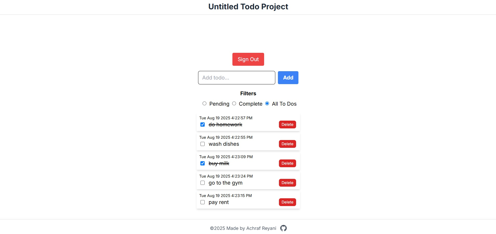

# Untitled Todo Project

A simple Todo application built with [Next.js](https://nextjs.org/) and [Firebase](https://firebase.google.com/). This app demonstrates authentication, Firestore CRUD operations, and modern React features.



## Features

- User authentication (sign up, sign in, sign out) with Firebase Auth
- Add, edit, complete, and delete todos (per user) using Firestore
- Real-time updates with Firestore listeners
- Responsive UI styled with Tailwind CSS
- Protected routes: only authenticated users can access the todo app

## Getting Started

### 1. Clone the repository

```bash
git clone https://github.com/your-username/untitled-todo-project.git
cd untitled-todo-project
```

### 2. Install dependencies

```bash
npm install
# or
yarn install
```

### 3. Configure Firebase

Create a `.env` file in the root directory and add your Firebase config:

```
NEXT_PUBLIC_FIREBASE_API_KEY=your_api_key
NEXT_PUBLIC_FIREBASE_AUTH_DOMAIN=your_auth_domain
NEXT_PUBLIC_FIREBASE_PROJECT_ID=your_project_id
NEXT_PUBLIC_FIREBASE_STORAGE_BUCKET=your_storage_bucket
NEXT_PUBLIC_FIREBASE_MESSAGING_SENDER_ID=your_messaging_sender_id
NEXT_PUBLIC_FIREBASE_APP_ID=your_app_id
NEXT_PUBLIC_FIREBASE_MEASUREMENT_ID=your_measurement_id
```

### 4. Run the development server

```bash
npm run dev
# or
yarn dev
```

Open [http://localhost:3000](http://localhost:3000) to view the app.

## Project Structure

- `app/` - Next.js app directory (pages, components, layouts)
- `app/todo-app/` - Main todo app logic and UI
- `app/lib/` - Firebase and utility logic

## Deployment

You can deploy this app to [Vercel](https://vercel.com/) or any platform that supports Next.js.